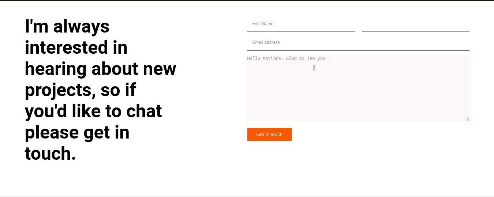

# curriculum-cr-training-contact-form

> This project is part of the training exercise for becoming a code reviewer at microverse.
> Application is based on this [Figma design](https://www.figma.com/file/t3EJUCAEViw3QasuJLPLVT/Microverse-Student-Potfolio-Templates-Main?node-id=1%3A1471).

## Built With

- HTML
- CSS
- GitHub

## Live Demo

[Live Demo Link](https://raw.githack.com/HillaryOkello/curriculum-cr-training-contact-form/feature/contact-form/index.html)

## Author

👤 **Hillary Okello**

- GitHub: [@githubhandle](https://github.com/HillaryOkello)
- Twitter: [@twitterhandle](https://twitter.com/Kellyhillary4)
- LinkedIn: [LinkedIn](https://www.linkedin.com/in/hillary-okello-b173101a4/)

## 🤝 Contributing

Contributions, issues, and feature requests are welcome!

Feel free to check the [issues page](https://github.com/HillaryOkello/curriculum-cr-training-contact-form/issues).

## Show your support

Give a ⭐️ if you like this project!

## Acknowledgments

- Microverse

## 📝 License

This project is [MIT](/LICENCE) licensed.
